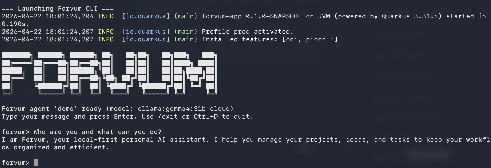

<p align="center">
  <picture>
    <source media="(prefers-color-scheme: dark)" srcset="docs/brand/forvum-mark.svg">
    
  </picture>
</p>

# Forvum

*A JVM platform for personal AI agents, designed in the open. The plan is written; the code follows, milestone by milestone.*

[](LICENSE)

> **Forvum is being designed and built around the principles documented in [Context Engineering for Multi-LLM Low-Latency Agents](docs/CONTEXT-ENGINEERING.md). See [how Forvum maps to those principles](docs/CONTEXT-ENGINEERING-MAPPING.md).**

Forvum is a JVM platform being built to let anyone run personal AI agents on their own machine — with the same discipline enterprise Java brings to any other production system. The full architectural vision lives in [docs/ULTRAPLAN.md](docs/ULTRAPLAN.md), covering the core contracts for agents, events, budgets, and scope isolation. The `main` branch currently ships the multi-module Maven bootstrap and the design documentation; a working vertical slice — a single agent against a local Ollama model via an interactive CLI — lives on the `demo/conference-mvp` branch. Implementation proceeds milestone by milestone. If you're a Java developer who wants an AI layer on your own terms, contributions to design or code are welcome.

## Status

In active design and early implementation. `main` ships the Maven bootstrap and the architectural design rounds documented in [docs/design-rounds/](docs/design-rounds/). A conference-demo MVP is available on the `demo/conference-mvp` branch. Not yet production-ready.

## Quick demo

The demo lives on the `demo/conference-mvp` branch and runs a single agent against an Ollama model via an interactive CLI.



**Prerequisites:**

- Java 25
- Maven 3.9+ (or use the bundled `./mvnw`)
- [Ollama](https://ollama.com/) installed and running (`ollama serve`)
- A model reference configured in `agents/demo.json`. The default is `ollama:gemma4:31b-cloud`, which requires Ollama cloud access — run `ollama pull gemma4:31b-cloud` with your Ollama account signed in; see [ollama.com](https://ollama.com/) for account setup. For a fully local alternative, edit `agents/demo.json` to use a model you have pulled locally — models with at least 3B parameters tend to follow system prompts reliably.

**Optional (local models only):** export `OLLAMA_KEEP_ALIVE=30m` before running to prevent Ollama from unloading the model during idle periods. The default keep-alive is 5 minutes, which can trigger reload latency between turns during longer sessions.

**Run:**

```bash
git clone https://github.com/eldermoraes/forvum.git
cd forvum
git checkout demo/conference-mvp

# Optional — local models only
export OLLAMA_KEEP_ALIVE=30m

./mvnw package -pl forvum-app -am -DskipTests
java -jar forvum-app/target/quarkus-app/quarkus-run.jar
```

**Example interaction:**

```
Forvum agent 'demo' ready (model: ollama:gemma4:31b-cloud)
Type your message and press Enter. Use /exit or Ctrl+D to quit.

forvum> who are you?
I am Forvum, your local-first personal AI assistant. I'm here to help you manage your projects, ideas, and tasks.

forvum> who made you?
I am Forvum, a personal AI assistant running on the JVM via Quarkus and LangChain4j.

forvum> /exit
```

## Architecture

Forvum is organized as a Maven reactor with five modules, structured to match the architectural vision. The current `main` branch ships the module skeleton; implementation lands milestone by milestone per the roadmap below.

- **`forvum-core`** — pure Java value contracts with no framework dependencies (agent IDs, model references, event types). Specified in [docs/ULTRAPLAN.md](docs/ULTRAPLAN.md) §4.3.
- **`forvum-sdk`** — public SPI for extension points (model providers, channels, tools). Specified in [docs/ULTRAPLAN.md](docs/ULTRAPLAN.md) §2.2.
- **`forvum-engine`** — Quarkus engine, extension-agnostic. Orchestrates agent lifecycle, resolves specs, emits events. Specified in [docs/ULTRAPLAN.md](docs/ULTRAPLAN.md) §2.3.
- **`forvum-bom`** — centralized dependency version management.
- **`forvum-app`** — the runnable assembly. Wires providers, hosts the Picocli CLI, boots Quarkus.

For the full architecture — decisions, tradeoffs, and deferred design — read [docs/ULTRAPLAN.md](docs/ULTRAPLAN.md) and the design round records in [docs/design-rounds/](docs/design-rounds/).

## Roadmap

Implementation proceeds in milestones M1 through M20:

- **M1 (complete)** — multi-module Maven bootstrap and the Tier 1 contract design rounds.
- **M2–M20 (planned)** — core contract materialization, persistence, budget enforcement, fallback chains, observability, channels, DevUI, sub-agents, judging, and production hardening.

Detailed milestone scope is in [docs/ULTRAPLAN.md](docs/ULTRAPLAN.md) §7.

## Contributing

Design contributions are welcome before code. The design round workflow in [docs/design-rounds/](docs/design-rounds/) documents how architectural decisions are proposed, debated, and recorded. See [CONTRIBUTING.md](CONTRIBUTING.md) for the short version.

## License

Apache 2.0 — see [LICENSE](LICENSE).
